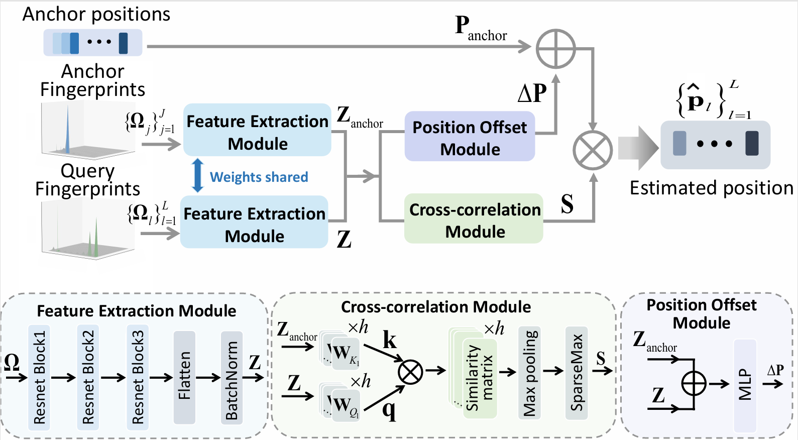

# TUP: A Transferable Model for Wireless User Positioning with Few-Shot Learning 

[](https://ieeexplore.ieee.org/abstract/document/11463137)


**TUP** is a transferable fingerprint-based framework for wireless user positioning.  This work has been **accepted as an Oral presentation at ICASSP 2026**.

---

## Overview

Wireless fingerprint-based positioning methods achieve high accuracy but typically require large labeled datasets and retraining in new environments. TUP addresses this limitation by learning **relative relationships** between query samples and anchor points, rather than absolute mappings.
<div align=center>  </div>

Instead of predicting positions directly, TUP:
- compares query fingerprints with anchor fingerprints
- computes similarity scores
- predicts positions as a **similarity-weighted sum of anchor offsets**

This design enables:
-  **transferability across environments**
- effective **few-shot learning**


## Citation
> 🌟 If you find this resource helpful, please consider to star this repository and cite our research:
```tex
@INPROCEEDINGS{11463137,
  author={Chen, Panqi and Cheng, Lei and You, Li and Gerstoft, Peter},
  booktitle={ICASSP 2026 - 2026 IEEE International Conference on Acoustics, Speech and Signal Processing (ICASSP)}, 
  title={TUP: A Transferable Model for Wireless User Positioning With Few-Shot Learning}, 
  year={2026},
  volume={},
  number={},
  pages={21106-21110},
  keywords={User positioning;Transfer learning;Attention;Environment-aware representation},
  doi={10.1109/ICASSP55912.2026.11463137}}

```
In case of any questions, bugs, suggestions or improvements, please feel free to open an issue.

